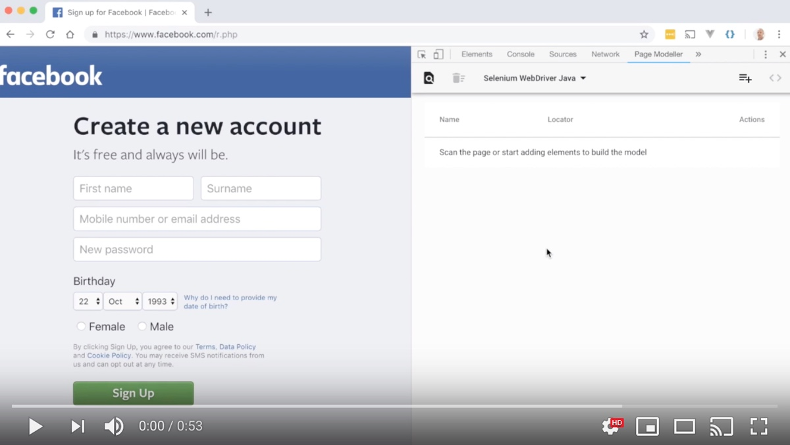
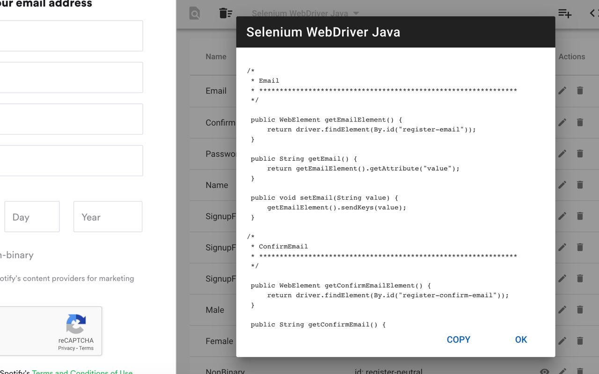
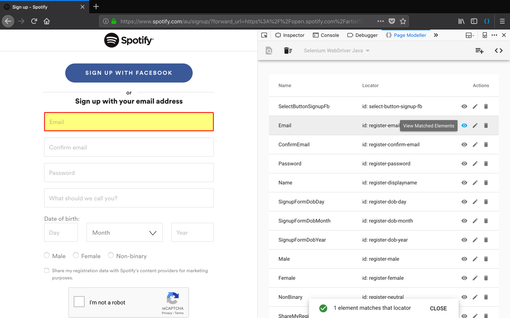
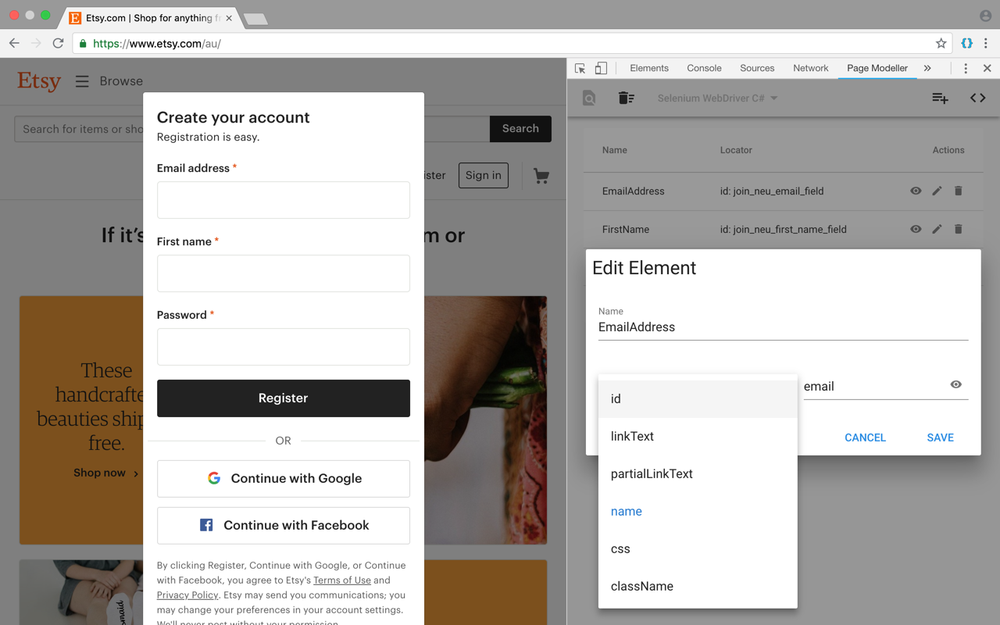
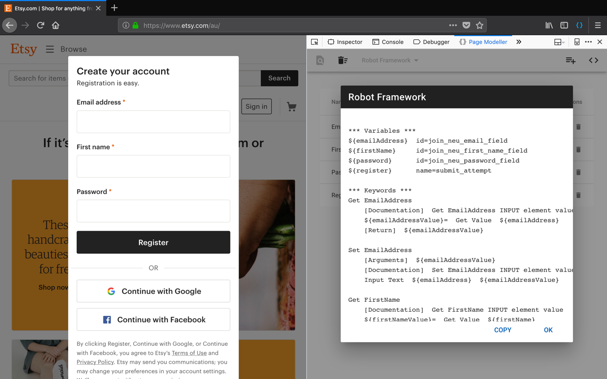
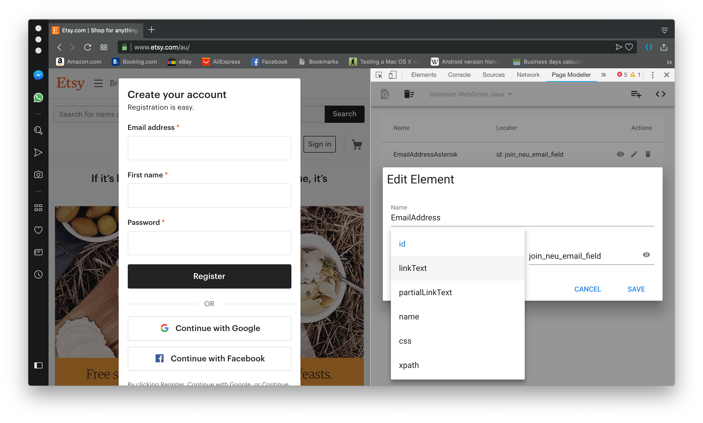

#  Page Modeller

> Chrome, Firefox and Opera DevTools extension for modelling web pages for automation.

The Page Modeller extension enables developers to scan a web page and generate page object style code for various tools, languages and frameworks and test the UI locators in the browser.

Currently supported tools and languages are:

- Selenium WebDriver Java
- Selenium WebDriver C#
- Puppeteer
- Robot Framework

## Contents

- [Installation](https://github.com/danhumphrey/page-modeller#installation)
- [Usage](https://github.com/danhumphrey/page-modeller#usage)
- [Screenshots](https://github.com/danhumphrey/page-modeller#screenshots)
- [Contribute](https://github.com/danhumphrey/page-modeller#contribute)
- [License](https://github.com/danhumphrey/page-modeller#license)

## Installation

Install the browser extension from the links below:

https://chrome.google.com/webstore/detail/page-modeller/ejgkdhekcepfgdghejpkmbfjgnioejak

https://addons.mozilla.org/en-US/firefox/addon/page-modeller/

https://addons.opera.com/en/extensions/details/page-modeller/

## Usage

   

  Click to watch demonstration video on YouTube.

## Screenshots

   

   

   

   

   

## Contribute

### Bugs and Suggestions

If you like this extension, please :star: this repository!

Feel free to propose new functionality and additional frameworks here: https://github.com/danhumphrey/page-modeller/issues

This extension is being actively developed and is considered a beta release.

### Code Contributions

1. Fork this repository
2. Create your feature branch (`git checkout -b my-new-feature`)
3. Commit your changes (`git commit -am 'Added some feature'`)
4. Push to your branch (`git push origin my-new-feature`)
5. Create a new Pull Request

## License

This library is distributed under the MIT license. Please see the [LICENSE](https://github.com/danhumphrey/page-modeller/blob/master/LICENSE) file.

:point_up_2: I really should call this "licence" as I don't live in the US, but I'm adopting the MIT spelling :wink:
