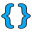
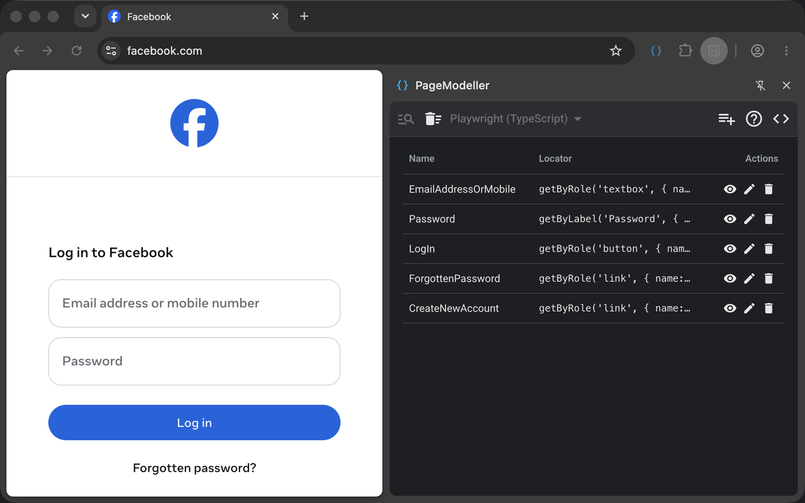
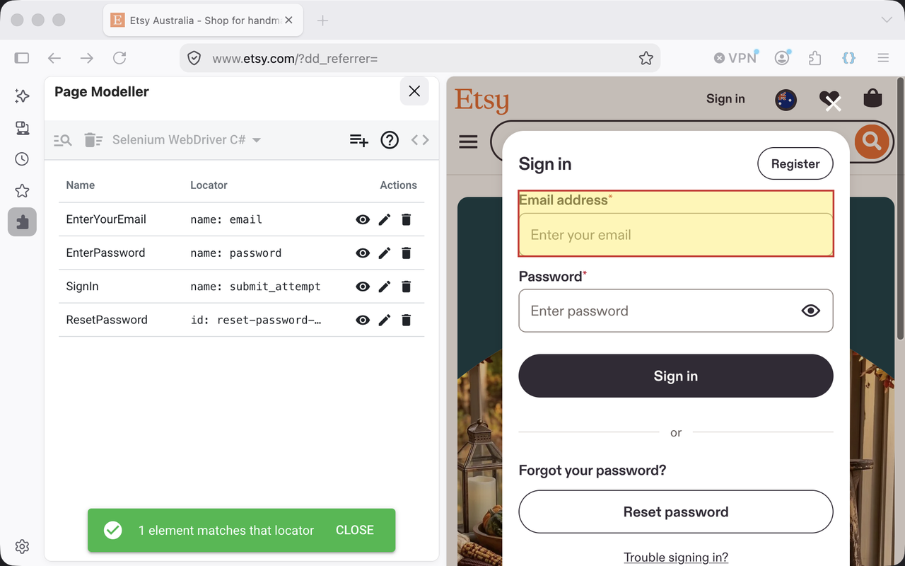
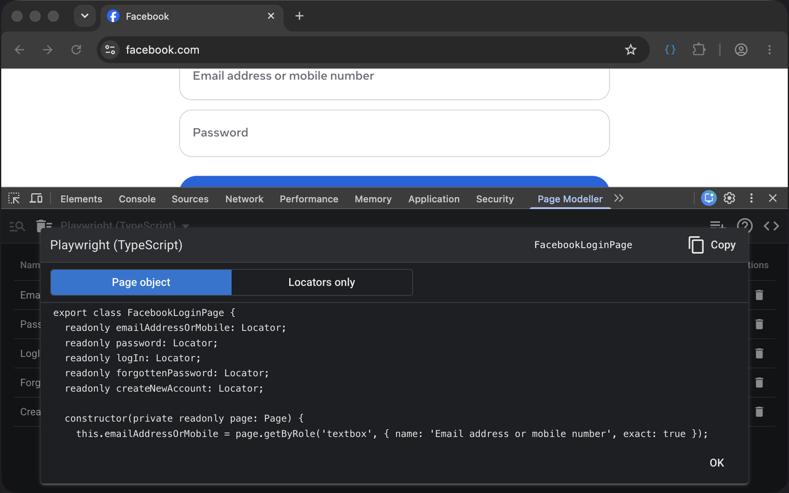
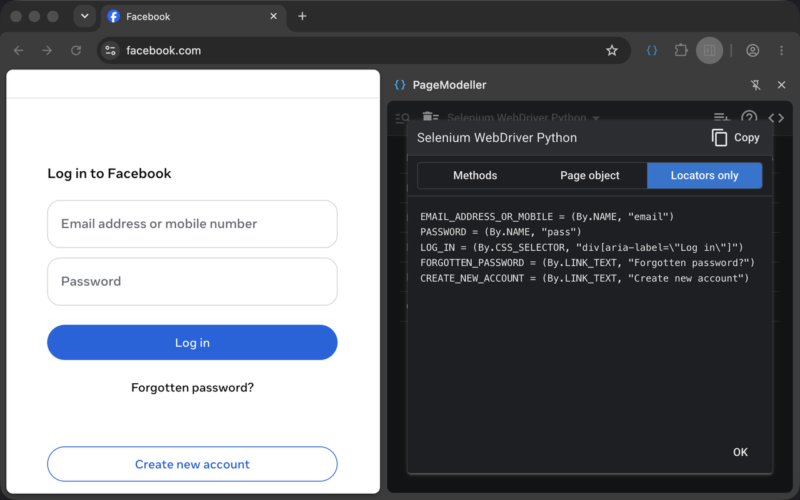

#  Page Modeller

> Browser DevTools extension for modelling web pages for automation.

The Page Modeller extension enables developers to scan a web page and generate page object style code
for various tools, languages and frameworks, and test the UI locators in the browser.

Current release: **3.0.0**

Supported tools and languages are:

- Playwright (TypeScript)
- Playwright (Python)
- Selenium WebDriver Java
- Selenium WebDriver C#
- Selenium WebDriver Python
- Puppeteer

## What's new in 3.0 

A complete rewrite!

**Playwright**, in TypeScript and Python, generating role- and label-based locators.

**Elements inside iframes.** The frame an element lives in is part of its locator, so the generated
code enters the frames to reach it: `frameLocator` chains for Playwright, a `switchTo().frame()` chain
for Selenium. Cross-origin, `srcdoc` and sandboxed frames included.

**Elements inside shadow DOM.** Web components keep their real controls in a shadow root, where an
ordinary DOM walk cannot see them. Page Modeller now scans into open shadow roots and generates locators that reach them: `page.locator('my-field').locator(...)`,
Puppeteer's `>>>`, Selenium's `getShadowRoot()` chain.

**Alternate code generation styles by framework and language** generate a full page object, methods or just the locators.

**New side panel**, in addition to the existing DevTools panel.

**Framework aware locators**, and match validation within the browser - the way the framework locates elements, not the
browser.

Removed: Robot Framework and Protractor, neither of which is maintained upstream.

## Contents

- [What's new in 3.0](https://github.com/danhumphrey/page-modeller#whats-new-in-30)
- [Browser Support](https://github.com/danhumphrey/page-modeller#browser-support)
- [Installation](https://github.com/danhumphrey/page-modeller#installation)
- [Usage](https://github.com/danhumphrey/page-modeller#usage)
- [Output](https://github.com/danhumphrey/page-modeller#output)
- [Options](https://github.com/danhumphrey/page-modeller#options)
- [Screenshots](https://github.com/danhumphrey/page-modeller#screenshots)
- [Contribute](https://github.com/danhumphrey/page-modeller#contribute)
- [License](https://github.com/danhumphrey/page-modeller#license)

## Browser Support

  

Chrome 114+ and Firefox 115+, on Manifest V3. Page Modeller runs as a **side panel** or
**sidebar** (when supported) or as a **DevTools panel** in all browsers.

Other Chromium browsers install from the Chrome Web Store listing. Brave and Vivaldi have the side
panel and work exactly as Chrome does. **Opera has no extension side panel API** so the DevTools panel must be used in Opera.

## Installation

Install the extension using the links below:

https://chromewebstore.google.com/detail/page-modeller-selenium-ro/ejgkdhekcepfgdghejpkmbfjgnioejak

https://addons.mozilla.org/en-US/firefox/addon/page-modeller/

## Usage

  

  Click to watch demonstration video on YouTube.

Open the side panel from the toolbar icon, or find **Page Modeller** in DevTools, then:

- **Add Element** — pick one element anywhere on the page. Hold **⌘** (or **Ctrl**) while clicking to
  keep picking, and let go on the last one. The **↑ / ↓** arrows walk the selection up and down the
  nesting when the element you want sits underneath the one you can hover.
- **Scan Page** — pick a container, such as a form, and every interactive element inside it enters the
  model at once.
- **The eye** on a row shows what that locator actually matches, before you trust it.
- **Generate Code** for the framework you chose.

Elements inside **iframes** and inside a web component's **shadow DOM** are picked the same way. Where
an element lives is part of its locator, so it is shown in the row and in the edit dialog, and the
generated code walks the chain to reach it — you do not have to know it is there.

## Output

Every framework generates a full page object or **locators only**. Selenium also offers its **methods** shape,
the getters and interaction methods v2.5.1 generated.

Locators are computed from the page itself: the accessible role and name first, then the attributes and a structural CSS or XPath path only as a last resort. Every candidate locator is
checked against the page before it is used, in the way the **chosen framework** would make it, which is not always the way the
browser would. Playwright's own engines see inside web components and Selenium's do not, so the same
page can hold a button that is unique to one framework and ambiguous to another.

It is all deterministic and entirely offline. No LLM, no network requests, nothing leaves the browser.

## Options

Options can be configured via the browser extension options.

- Show tooltips
- Append the element type to names
- Model hidden elements
- Click a row to view matched elements
- Theme — System, Light or Dark
- Test ID attribute — `data-testid` by default; set it to whatever your test runner uses

## Screenshots

  

  

  

  

## Contribute

### Bugs and Suggestions

If you like this extension, please :star: this repository!

Feel free to propose new functionality and additional frameworks here:
https://github.com/danhumphrey/page-modeller/issues

### Code Contributions

See [CONTRIBUTING.md](CONTRIBUTING.md) for the stack, the scripts, and how the work is verified.

1. Fork this repository
2. Create your feature branch (`git checkout -b my-new-feature`)
3. Commit your changes (`git commit -am 'Added some feature'`)
4. Push to your branch (`git push origin my-new-feature`)
5. Create a new Pull Request

## License

This library is distributed under the MIT license. Please see the
[LICENSE](https://github.com/danhumphrey/page-modeller/blob/master/LICENSE) file.

:point_up_2: I really should call this "licence" as I don't live in the US, but I'm adopting the MIT
spelling :wink:
